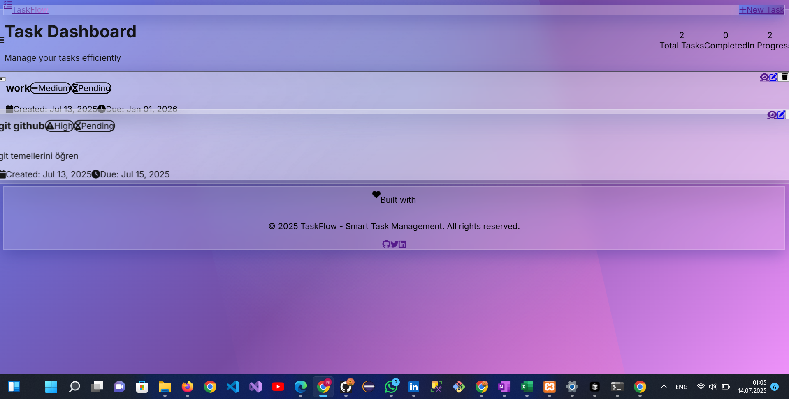

  

📋 README Contents:
�� Project Overview
Clear description of TaskFlow as a modern task management application
Technology stack badges (Laravel 12, TailwindCSS 3, PHP 8.2, MySQL)
✨ Features Section
Core Functionality: Task management, priority levels, status tracking
Modern Design: Glassmorphism UI, animations, responsive design
Performance & UX: Fast loading, accessibility, mobile-friendly
🛠️ Technical Details
Complete technology stack breakdown
System requirements
Step-by-step installation guide
Project structure overview
🎨 Design Features
Detailed explanation of glassmorphism effects
Animation descriptions (floating, pulse, hover effects)
Color scheme documentation
Accessibility features
🔧 Development Guide
Customization instructions
How to add new features
Deployment guidelines
Contributing guidelines
📞 Support & License
Support information
MIT license
Acknowledgments
Professional footer
🚀 Key Highlights:
Professional Presentation: Clean, organized structure with emojis and badges
Complete Documentation: From installation to deployment
Technical Accuracy: All details match your actual project
User-Friendly: Easy to follow instructions
Comprehensive: Covers all aspects of the project
The README is now ready and provides a complete overview of your TaskFlow application for English-speaking developers and users!
